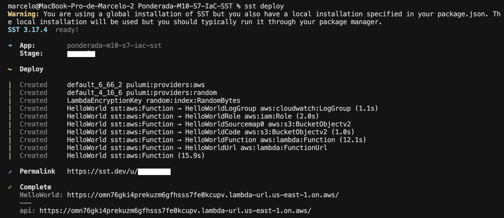
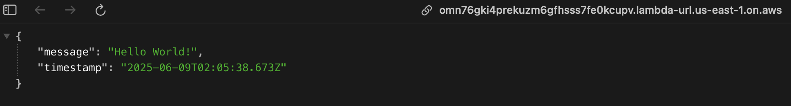

# 🚀 Aplicação Serverless Hello World com SST

Uma aplicação serverless simples desenvolvida com **SST (Serverless Stack)** que demonstra a criação e deploy de uma função Lambda na AWS retornando "Hello World".

## 📋 Índice

- [Sobre o Projeto](#sobre-o-projeto)
- [Tecnologias Utilizadas](#tecnologias-utilizadas)
- [Passo a Passo da Implementação](#passo-a-passo-da-implementação)
- [Recursos Provisionados na AWS](#recursos-provisionados-na-aws)
- [Resultados Obtidos](#resultados-obtidos)
- [Como Executar](#como-executar)
- [Estrutura do Projeto](#estrutura-do-projeto)

## 🎯 Sobre o Projeto

Este projeto demonstra a implementação de uma aplicação serverless utilizando **SST v3** para provisionar infraestrutura como código na AWS. A aplicação consiste em uma função Lambda simples que retorna uma resposta JSON com "Hello World" e timestamp.

**Objetivo:** Aprender os conceitos básicos de Infrastructure as Code (IaC) utilizando SST para provisionamento automático de recursos na AWS.

## 🛠️ Tecnologias Utilizadas

- **SST v3** - Framework para aplicações serverless
- **AWS Lambda** - Computação serverless
- **AWS CloudWatch** - Monitoramento e logs
- **AWS IAM** - Gerenciamento de identidade e acesso
- **Node.js** - Runtime da aplicação
- **JavaScript/TypeScript** - Linguagens de programação

## 📝 Passo a Passo da Implementação

### 1. Inicialização do Projeto

Criação do projeto Node.js e inicialização do SST:

```bash
# Criar diretório e inicializar npm
mkdir my-sst-app && cd my-sst-app
npm init -y

# Inicializar SST
npx sst@latest init
npm install
```

### 2. Configuração da Infraestrutura

**Arquivo: `sst.config.ts`**

Configuração da função Lambda com URL pública habilitada:

```typescript
export default $config({
  app(input) {
    return {
      name: "ponderada-m10-s7-iac-sst",
      removal: input?.stage === "production" ? "retain" : "remove",
      protect: ["production"].includes(input?.stage),
      home: "aws",
    };
  },
  async run() {
    const helloFunction = new sst.aws.Function("HelloWorld", {
      url: true,
      handler: "index.handler",
    });

    return {
      api: helloFunction.url,
    };
  },
});
```

### 3. Implementação da Função Lambda

**Arquivo: `index.js`**

Handler que retorna resposta JSON com "Hello World":

```javascript
export const handler = async (event) => {
  return {
    statusCode: 200,
    headers: {
      "Content-Type": "application/json",
    },
    body: JSON.stringify({
      message: "Hello World!",
      timestamp: new Date().toISOString(),
    }),
  };
};
```

### 4. Deploy da Aplicação

Execução do comando de deploy para provisionar recursos na AWS:

```bash
sst deploy
```



*Figura 1: Resultado do deploy mostrando os recursos criados na AWS*

## ☁️ Recursos Provisionados na AWS

Durante o deploy, o SST provisionou automaticamente os seguintes recursos na AWS:

### 📊 Recursos Criados

| Recurso | Tipo | Função |
|---------|------|--------|
| **HelloWorldFunction** | `aws:lambda:Function` | Função Lambda principal |
| **HelloWorldLogGroup** | `aws:cloudwatch:LogGroup` | Grupo de logs da função |
| **HelloWorldRole** | `aws:iam:Role` | Role IAM para execução |
| **HelloWorldUrl** | `aws:lambda:FunctionURL` | URL pública da função |
| **LambdaEncryptionKey** | `aws:kms:Key` | Chave de criptografia |
| **Providers** | `pulumi:providers` | Provedores Pulumi |

### 🔧 Detalhes dos Recursos

- **Função Lambda**: Runtime Node.js com handler configurado
- **IAM Role**: Permissões básicas para execução da Lambda
- **CloudWatch Logs**: Captura automática de logs da aplicação
- **Function URL**: Endpoint HTTPS público para acesso direto
- **KMS Key**: Criptografia para dados em repouso

### 📍 URL de Acesso

```
https://omn76qki4prekuzm6qfhsss7fe0kcupv.lambda-url.us-east-1.on.aws/
```

## 📈 Resultados Obtidos

### ✅ Teste da Função Lambda

Ao acessar a URL da função Lambda, obtemos a resposta esperada:



*Figura 2: Resposta JSON da função Lambda com "Hello World" e timestamp*

**Resposta JSON:**
```json
{
  "message": "Hello World!",
  "timestamp": "2025-06-09T02:05:38.673Z"
}
```

### 🎯 Benefícios Alcançados

- ✅ **Infraestrutura como Código**: Recursos definidos e versionados
- ✅ **Deploy Automatizado**: Provisionamento com um comando
- ✅ **Serverless**: Escalabilidade automática e pagamento por uso
- ✅ **Monitoramento**: Logs automáticos no CloudWatch
- ✅ **Segurança**: IAM roles e criptografia configuradas

## 🚀 Como Executar

### Pré-requisitos

- Node.js instalado
- AWS CLI configurado com credenciais válidas
- Conta AWS ativa

### Passos para Execução

1. **Clone o repositório:**
```bash
git clone <repository-url>
cd ponderada-m10-s7-iac-sst
```

2. **Instale as dependências:**
```bash
npm install
```

3. **Configure suas credenciais AWS:**
```bash
aws configure
```

4. **Execute o deploy:**
```bash
sst deploy
```

5. **Teste a aplicação:**
   - Acesse a URL fornecida no output do deploy
   - Verifique a resposta JSON no navegador

6. **Para remover os recursos:**
```bash
sst remove
```

## 📁 Estrutura do Projeto

```
ponderada-m10-s7-iac-sst/
├── sst.config.ts          # Configuração da infraestrutura SST
├── index.js               # Handler da função Lambda
├── package.json           # Dependências do projeto
├── README.md             # Documentação do projeto
├── assets
|   ├── Deploy_SST.png        # Print do deploy realizado
|   └── Teste_Lambda.png      # Print do teste da função
└── .sst/                 # Arquivos internos do SST
```

## 🔍 Considerações Técnicas

- **Região AWS**: us-east-1 (padrão)
- **Runtime**: Node.js (última versão suportada)
- **Timeout**: 30 segundos (padrão)
- **Memória**: 1024MB (padrão)
- **Arquitetura**: x86_64

## 📚 Referências

- [Documentação SST v3](https://sst.dev/docs/)
- [AWS Lambda Documentation](https://docs.aws.amazon.com/lambda/)
- [Infrastructure as Code Best Practices](https://docs.aws.amazon.com/whitepapers/latest/introduction-devops-aws/infrastructure-as-code.html)

---

**Desenvolvido com ❤️ utilizando SST e AWS**
